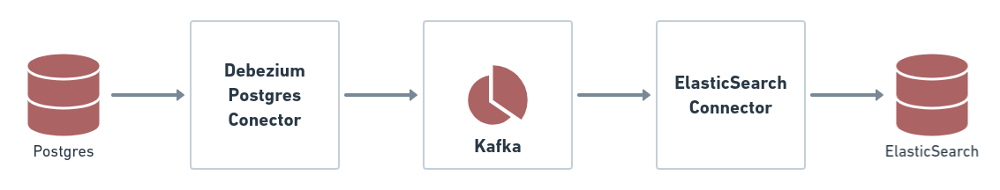

<p align="center">
  <a href="" rel="noopener">
 </a>
</p>

<h3 align="center">Debezium Docker Example</h3>

<div align="center">

[]()
[]()
[](https://github.com/JeanPoffo/debezium-docker-example/issues)
[](https://github.com/JeanPoffo/debezium-docker-example/pulls)

</div>

---

<p align="center"> 📤 A Docker Compose stack based on Debezium to create a CDC infrastructure
    <br> 
</p>


## 📝 Table of Contents

- [About](#about)
- [How it works](#working)
- [Usage](#usage)
- [Getting Started](#getting_started)
- [Built Using](#built_using)
- [Authors](#authors)

## 🧐 About <a name = "about"></a>

A docker compose stack to create a CDC (Change Data Capture) infrastructure. Is based on Debezium plugin, replicating a Postgres base to Elasticsearch server.

## 💭 How it works <a name = "working"></a>

<p align="center">
 
</p>

## 🎈 Usage <a name = "usage"></a>

Some useful links to query the data processing:

#### Kibana

http://localhost:5601

#### PgAdmin

http://localhost:16543

#### Elastic Data

http://localhost:9200/musics/_search?pretty=true

#### Connectors

http://localhost:8083/connectors

#### Connectors Status

http://localhost:8083/connectors?expand=status

#### Connectors Info

http://localhost:8083/connectors?expand=info

## 🏁 Getting Started <a name = "getting_started"></a>

Just clone and execute this steps:

#### Initialize Docker

```bash
docker-compose up --detach --build --force-recreate
```

#### Crete ElasticSearch Index and Apache Kafka Conectors

```bash
sh setup.sh
```

### Prerequisites

```
Docker Compose 1.29.2
Docker 20.10.10
```

## ⛏️ Built Using <a name = "built_using"></a>

- [Debezium](https://debezium.io/) - Open source distributed platform for change data capture.
- [Apache Kafka](https://kafka.apache.org/) - Open source distributed event streaming platform.
- [Apache ZooKeeper](https://zookeeper.apache.org/) - Centralized service for maintaining configuration information, naming, providing distributed synchronization, and providing group services.
- [ElasticSearch](https://www.elastic.co/pt/what-is/elasticsearch/) - A search engine based on the Apache Lucene library. It provides a distributed, multitenant-capable full-text search engine with an HTTP web interface and schema-free JSON documents.
- [PostgreSQL](https://www.postgresql.org/) - Open source object-relational database system.

## ✍️ Authors <a name = "authors"></a>

- [@JeanPoffo](https://github.com/JeanPoffo)